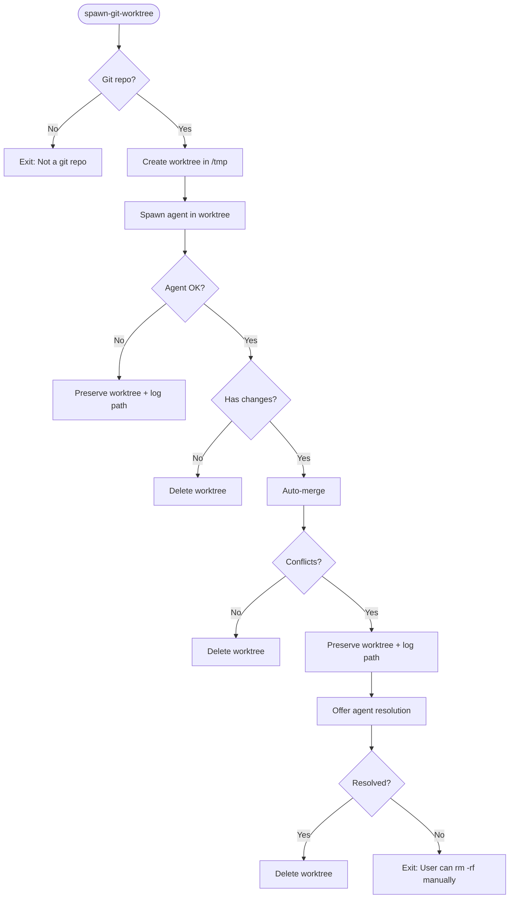

# Git Worktrees Feature - Implementation Plan

## Overview

This feature can be implemented as both:
1. **CLI command:** `poe-code spawn-git-worktree <agent> <prompt> [agentArgs...]`
2. **Agent tool:** Can be added to [`src/services/tools.ts`](src/services/tools.ts:227) following the existing pattern

**Architecture Compatibility:** ✅ The existing tool system in [`DefaultToolExecutor`](src/services/tools.ts:20) fully supports adding this as a tool by:
- Adding tool definition to [`getAvailableTools()`](src/services/tools.ts:227)
- Adding case to [`executeTool()`](src/services/tools.ts:44) switch
- Implementing handler method (e.g., `spawnGitWorktree()`)

## Command

## Core Architecture

### 1. Worktree Utility (`src/utils/worktree.ts`)

**Key Functions:**
```typescript
interface WorktreeContext {
  path: string;
  branchName: string;
  cleanup: () => Promise<void>;
}

// Core operations
isGitRepository(cwd: string): Promise<boolean>
createWorktree(basePath: string): Promise<WorktreeContext>
getChanges(path: string): Promise<{ hasCommits: boolean; files: string[] }>
mergeChanges(worktreePath: string, targetBranch: string): Promise<MergeResult>
```

**Temp Directory:** Use `os.tmpdir()` + `poe-worktree-{timestamp}-{random}`

**Branch Naming:** `poe-worktree/{timestamp}-{hash}`

### 2. Command Handler (`src/commands/spawn-worktree.ts`)

**Workflow:**
1. Validate git repository (fail early if not)
2. Create worktree in temp directory
3. Spawn agent with `process.chdir(worktreePath)`
4. On success: detect changes and auto-merge
5. On conflicts: spawn same agent with resolution prompt
6. Delete worktree directory **only on successful merge**

**Code Preservation:**
- **Never delete worktree on errors** - preserve for manual recovery
- Log worktree path prominently on any failure
- Only delete after successful merge
- User can manually `rm -rf <worktree-path>` if needed

### 3. Merge Strategy

**Auto-merge (default):**
- If commits exist: `git merge --no-ff`
- If only file changes: copy files to main repo
- On conflicts: **preserve worktree** and offer agent-based resolution

**Conflict Resolution:**
```
Prompt: "Merge conflicts in: {files}. Resolve using git commands."
Commands: git diff --name-only --diff-filter=U, git add, git commit
```

**Deletion Policy:**
- ✅ Delete on: successful merge, no changes detected
- ❌ Never delete on: agent errors, merge conflicts, process crashes
- 📍 Always log: worktree path for manual access/deletion

## Implementation Steps

### Phase 1: Core Utilities
- [ ] Add `simple-git` dependency
- [ ] Create worktree utility with git operations
- [ ] Implement cross-platform temp directory creation

### Phase 2: Command
- [ ] Create spawn-worktree command handler
- [ ] Register in program.ts
- [ ] Implement agent spawning in worktree context

### Phase 3: Merge & Deletion
- [ ] Add change detection
- [ ] Implement auto-merge logic
- [ ] Add conflict detection and resolution
- [ ] Delete worktree directory only on success

### Phase 4: Testing
- [ ] Unit tests for worktree utilities (memfs + mocked simple-git)
- [ ] Integration tests for full workflow
- [ ] Test conflict resolution flow

## Workflow Diagram



## Key Design Decisions

1. **Use simple-git:** Type-safe, promise-based, cross-platform
2. **Temp worktrees:** Isolated, no pollution of main repo
3. **Agent-based resolution:** Reuse same agent for conflict resolution
4. **Fail fast:** Exit early if not in git repo
5. **Preserve on errors:** Never delete code - only delete on success
6. **Simple cleanup:** Just `rm -rf` the directory when done

## Edge Cases

- **No git repo:** Fail immediately with clear error
- **Agent failure:** **Preserve worktree**, log path, exit with error
- **No changes:** Delete worktree and exit (no-op)
- **Conflicts:** **Preserve worktree**, log path, offer resolution
- **Process crash:** **Preserve worktree** (no deletion on SIGINT/SIGTERM)
- **Manual recovery:** User can `cd` to logged path or `rm -rf` to delete

## Safety Guarantees

1. **Code is never lost** - worktrees preserved on any error
2. **Clear recovery path** - logged worktree location for manual access
3. **Git safety** - all changes in isolated branch, main repo untouched
4. **Simple deletion** - just `rm -rf <path>` when done

## Dependencies

```json
{
  "dependencies": {
    "simple-git": "^3.25.0"
  }
}
